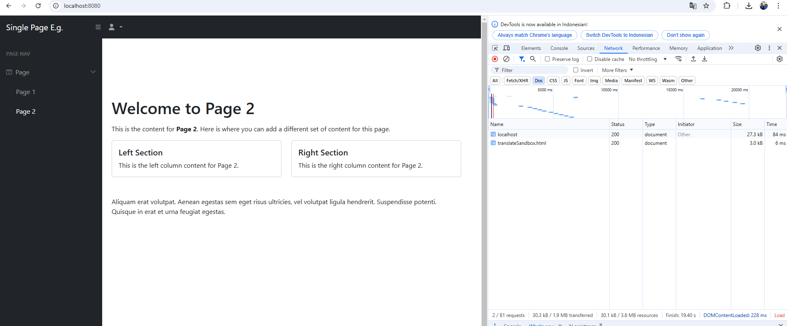

Here's a clean **GitHub-friendly README.md** file formatted for your **"Single Page App Example"** project:

---

# **Single Page App Example**

This project demonstrates a simple **Single Page Application (SPA)** using **CodeIgniter 4** as the backend framework and **Bootstrap 5** for responsive design. Pages are dynamically loaded without refreshing the entire page using a clean structure and modern approach.

---

## **Features**

- **Single Page Application (SPA)**: 
  Dynamic page loading without full-page reloads using JavaScript.
- **Responsive Sidebar Layout**: 
  Fixed sidebar with collapsible menu options.
- **CodeIgniter 4**: 
  Efficient PHP framework for clean backend management.
- **Bootstrap 5**: 
  Ensures a modern and responsive design.

---

## **Technologies Used**

- **PHP** (CodeIgniter 4)
- **HTML/CSS** (Bootstrap 5)
- **JavaScript** (Dynamic page loading)
- **FontAwesome** (Icons)

---

## **Project Structure**

```plaintext
app/
├── Controllers/
│   └── SPAController.php       # Handles page routing and dynamic views
├── Views/
│   ├── layouts/
│   │   ├── main.php            # Main layout (sidebar, topbar, and content)
│   │   ├── sidebar.php         # Sidebar menu
│   │   └── topbar.php          # Top navigation bar
│   └── pages/
│       ├── home.php            # Content for Home Page
│       ├── page1.php           # Content for Page 1
│       └── page2.php           # Content for Page 2
public/
├── css/
│   └── styles.css              # Custom styling
├── js/
│   └── scripts.js              # JavaScript logic for SPA
└── index.php                   # Entry point for the application
```

---

## **Setup Instructions**

Follow these steps to set up and run the project locally:

### **1. Clone the Repository**

```bash
git clone https://github.com/yourusername/single-page-app-example.git
cd single-page-app-example
```

### **2. Install Dependencies**

Ensure that you have Composer installed. Then, install the CodeIgniter dependencies:

```bash
composer install
```

### **3. Configure the Environment**

- Copy the **`env`** file to **`.env`**:

```bash
cp env .env
```

- Set the environment to `development`:

```plaintext
CI_ENVIRONMENT = development
```

---

### **4. Run the Application**

Start the built-in development server:

```bash
php spark serve
```

Visit the application in your browser at:

```
http://localhost:8080
```

---

## **Usage**

Dynamic pages can be loaded by navigating to the following URLs:

| **Page**         | **URL**                  |
|------------------|--------------------------|
| Home             | `/?page=home`           |
| Page 1           | `/?page=page1`          |
| Page 2           | `/?page=page2`          |
| Invalid Page     | Shows "Content not found" |

You can also use the **sidebar menu** to switch between pages dynamically.

---

## **Screenshots**

### **Home Page with Sidebar**


---

## **Customization**

You can add new pages by:

1. Creating a new file in the `app/Views/pages/` directory (e.g., `page3.php`).
2. Linking it in the sidebar menu:
   ```html
   <a class="nav-link" href="#" data-page="page3">Page 3</a>
   ```
3. The new page will dynamically load without refreshing.

---

## **Contributing**

Contributions are welcome! Here's how to contribute:

1. Fork the repository.
2. Create a new branch:
   ```bash
   git checkout -b feature-name
   ```
3. Commit your changes:
   ```bash
   git commit -m "Add a new feature"
   ```
4. Push the branch:
   ```bash
   git push origin feature-name
   ```
5. Open a Pull Request.

---


Feel free to replace:
- **`yourusername`** with your GitHub username.
- **`your-email@example.com`** with your email.
- Add actual screenshots in the `screenshots/` folder for better presentation.

Let me know if you need any further modifications! 🚀